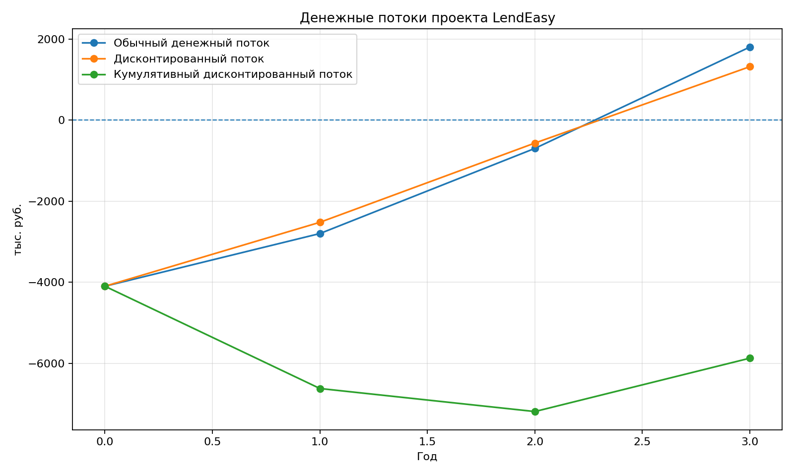
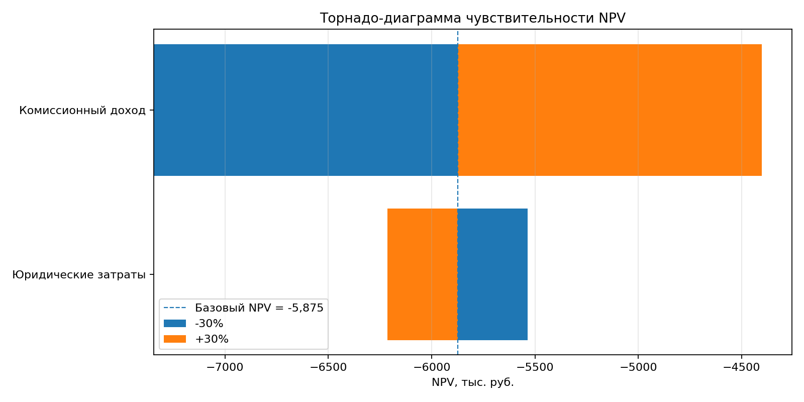
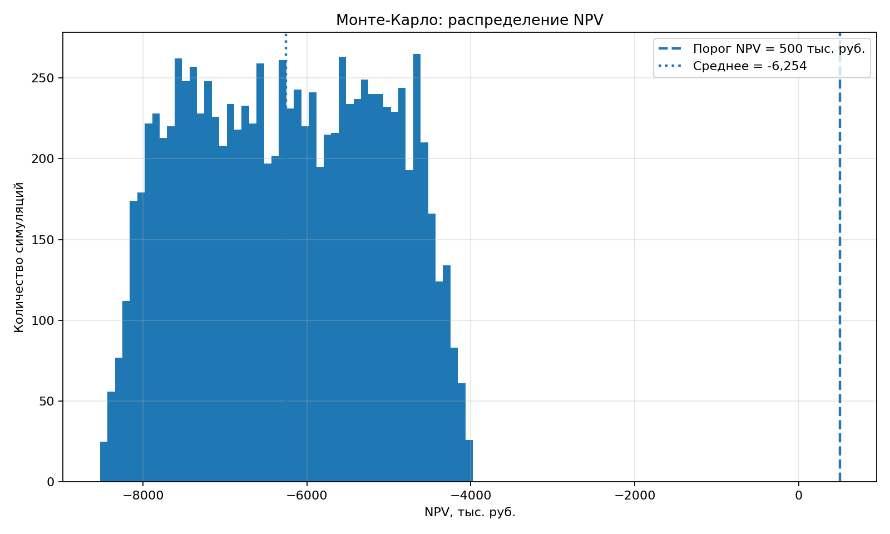

# 🚀 LendEasy — FinTech Project Economic Analysis

<div align="center">

# Практическое задание №7
## Управление IT-проектами
### Вариант 3 — Платформа для P2P-кредитования «LendEasy»

</div>

---

# 📖 О проекте

LendEasy — это FinTech-платформа для прямого кредитования между физическими лицами (Peer-to-Peer Lending).

Основная идея продукта заключается в создании цифровой площадки, которая позволяет:

- заёмщикам получать финансирование;
- инвесторам размещать средства под процент;
- платформе получать комиссионный доход от операций.

Проект рассматривается как стартап с горизонтом планирования 3 года.

В рамках данной работы выполнен полный цикл экономического анализа проекта:

✅ расчёт инвестиционной эффективности  
✅ анализ рисков  
✅ моделирование неопределённости  
✅ оценка распределённой Scrum-команды  
✅ автоматическая генерация отчёта и графиков

---

# 🎯 Цель работы

Определить, является ли запуск платформы LendEasy экономически целесообразным, а также оценить влияние неопределённости на финансовые результаты проекта.

---

# 🗺 Общая схема исследования

```text
Исходные данные
       │
       ▼
Расчёт TCO
       │
       ▼
Расчёт NPV
       │
       ▼
Расчёт PI и IRR
       │
       ▼
Анализ чувствительности
       │
       ▼
Торнадо-диаграмма
       │
       ▼
Моделирование Монте-Карло
       │
       ▼
Оценка рисков
       │
       ▼
Финальный HTML-отчёт
```

---

# 🏗 Структура проекта

```text
lendeasy_project/
│
├── data/
│
├── src/
│   ├── calculations.py
│   ├── sensitivity.py
│   ├── monte_carlo.py
│   └── report.py
│
├── figures/
│   ├── cashflow.png
│   ├── tornado.png
│   └── monte_carlo.png
│
├── reports/
│   └── lendeasy_report.html
│
├── main.py
├── requirements.txt
└── README.md
```

---

# ⚙️ Используемые технологии

| Инструмент | Назначение |
|------------|------------|
| Python | Основной язык |
| NumPy | Математические вычисления |
| Pandas | Обработка данных |
| Matplotlib | Визуализация |
| Git | Контроль версий |
| GitHub | Хранение проекта |
| HTML | Формирование отчёта |
| VS Code | Среда разработки |

---

# 🚀 Как запустить проект

## 1. Клонировать репозиторий

```bash
git clone <repository_url>
```

## 2. Перейти в проект

```bash
cd lendeasy_project
```

## 3. Создать виртуальное окружение

```bash
python3 -m venv venv
```

## 4. Активировать окружение

```bash
source venv/bin/activate
```

## 5. Установить зависимости

```bash
pip install -r requirements.txt
```

## 6. Запустить проект

```bash
python main.py
```

После запуска автоматически будут созданы:

```text
figures/cashflow.png
figures/tornado.png
figures/monte_carlo.png
reports/lendeasy_report.html
```

---

# 📊 Визуализации проекта

## Денежный поток



Данный график показывает изменение денежных потоков проекта по годам.

Он позволяет визуально определить периоды максимальных расходов и поступлений.

---

## Торнадо-диаграмма



Диаграмма демонстрирует чувствительность NPV к изменению ключевых факторов.

По результатам анализа было установлено, что наибольшее влияние оказывает комиссионный доход.

---

## Монте-Карло



Гистограмма показывает распределение возможных значений NPV при различных сценариях развития проекта.

---

# 💰 Экономические показатели

## TCO

### Формула

```text
TCO = Σ Все затраты проекта
```

### Результат

```text
14 200 тыс. руб.
```

### Что означает

Полная стоимость реализации и поддержки проекта за три года составляет 14,2 млн рублей.

---

## NPV

### Формула

```text
NPV = Σ CFt / (1+r)^t
```

### Результат

```text
-5 874,51 тыс. руб.
```

### Что означает

Проект не окупается в течение рассматриваемого периода.

---

## PI

### Формула

```text
PI = PV выгод / PV затрат
```

### Результат

```text
0,527
```

### Что означает

Каждый вложенный рубль приносит только 52,7 копейки дисконтированных выгод.

---

## IRR

### Результат

```text
-46,55%
```

### Что означает

Внутренняя доходность проекта отрицательная.

---

# ⚠️ Анализ чувствительности

Были исследованы два фактора:

1. юридические затраты;
2. комиссионный доход.

Диапазон изменения:

```text
-30%
-15%
0%
+15%
+30%
```

## Вывод

Основной фактор риска — снижение комиссионного дохода.

Даже небольшое сокращение объёма кредитования существенно ухудшает финансовый результат.

---

# 🎲 Моделирование Монте-Карло

## Почему использовался этот метод

Обычный расчёт NPV предполагает фиксированные значения затрат и доходов.

В реальности параметры постоянно изменяются.

Метод Монте-Карло позволяет моделировать тысячи возможных сценариев развития проекта.

---

## Параметры моделирования

```python
np.random.seed(42)
```

Количество симуляций:

```text
10000
```

---

## Что показали результаты

Проект остаётся чувствительным к изменению рыночных условий.

Наиболее опасным сценарием является снижение комиссионного дохода в первые годы существования платформы.

---

# 👥 Управление распределённой Scrum-командой

## Состав команды

| Роль | Локация |
|--------|---------|
| Product Owner | Берлин |
| Scrum Master | Стамбул |
| Team Lead | Баку |
| Python Developers | Казань |
| DevOps | Екатеринбург |
| QA Engineer | Тбилиси |

---

## Разделение ответственности

### Product Owner

- стратегия продукта;
- управление бэклогом;
- работа с инвесторами;
- бизнес-решения.

### Team Lead

- архитектура системы;
- технические решения;
- контроль качества кода;
- code review.

### Scrum Master

- Scrum-процессы;
- устранение препятствий;
- коммуникация команды.

---

# 🧠 Основные выводы исследования

## Положительные стороны

✅ Возможность масштабирования платформы

✅ Перспективный FinTech-рынок

✅ Потенциал роста комиссионного дохода

✅ Автоматизация кредитования

---

## Риски

⚠️ Высокие первоначальные инвестиции

⚠️ Низкий объём доходов в первые годы

⚠️ Высокая чувствительность к пользовательской активности

⚠️ Юридические и регуляторные риски

---

# 📌 Итоговое заключение

Расчёты показали:

| Показатель | Значение |
|------------|----------|
| TCO | 14 200 тыс. руб. |
| NPV | -5 874,51 тыс. руб. |
| PI | 0,527 |
| IRR | -46,55% |
| Поддержка | 13,38% |

С точки зрения классического инвестиционного анализа проект не демонстрирует достаточной финансовой эффективности в течение трёхлетнего горизонта планирования.

Однако для венчурного инвестора проект может представлять интерес благодаря возможности быстрого масштабирования и роста клиентской базы.

---


### Почему NPV отрицательный?

Потому что дисконтированные выгоды меньше дисконтированных затрат.

### Почему PI меньше единицы?

Потому что проект создаёт меньше ценности, чем объём вложенных инвестиций.

### Почему использовался Монте-Карло?

Для оценки риска и анализа неопределённости.

### Что показывает торнадо-диаграмма?

Она показывает, какие факторы сильнее всего влияют на итоговый NPV.

### Какой фактор оказался наиболее важным?

Комиссионный доход.

### Стоит ли запускать проект?

В текущем виде проект финансово неэффективен, однако при быстром росте пользовательской базы может стать привлекательным для венчурных инвесторов.

---

